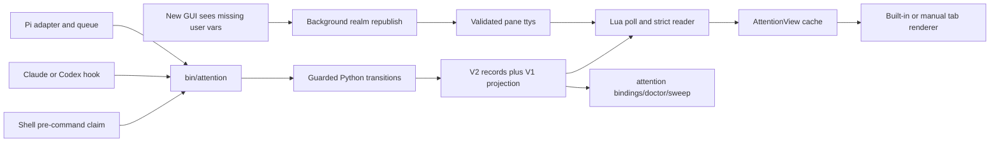

# wezterm-attention v2 — mux-native identity, records, and a plugin-owned tab bar

## Outcome and boundary

A supported agent pane publishes a mux-native address before its top-level agent process starts.
The plugin uses that address to read binding, activity, review, acknowledgement, and subagent facts
without using the GUI-local pane number as storage authority. After a GUI attaches, the first
successful republish sweep restores those addresses through each pane's tty; the next poll renders
the same state that another attached GUI sees.

The plugin owns identity publication, its record protocol, provider adapters, polling, rendering,
diagnostics, and cleanup of its own state. It does not own topology, restore, orchestration,
checkouts, provider conversations, or resume policy. External consumers receive validated facts
and derive their own argv from `(provider, provider_session_id)`.

This is a **Deep** plan. It introduces a persisted cross-language protocol, changes runtime
authority, and must preserve the shipped v1 API while Lua, Python, shell, and TypeScript agree on
the same meanings.

## Evidence carried forward

The earlier draft labelled all design choices resolved. The architect pass keeps the observations
but treats each mechanism as falsifiable.

| ID | Observation | Status in this blueprint |
|---|---|---|
| M1 | A mux client stores `SetUserVar` per client pane, but a value emitted before attach is not replayed. | Current WezTerm source supports the storage path; reattach behavior is covered by M11 and must be re-probed in U2. |
| M2 | WezTerm has no `pane-destroyed` event. | Preserve absence-based observation, but never let a GUI poll mutate a binding from window-local absence alone. |
| M3 | Mux notifications can rebuild the whole tab bar and enter Lua once per tab. | The formatter remains cache-only. |
| M4 | Rapid provider title changes can saturate a large GUI. | The plugin never writes pane or tab titles; settled-title fallback is sampled outside the formatter. |
| M5 | The current `format-tab-title` path reads only Lua cache state. | Verified in `plugin/init.lua`; this is an unchanged invariant. |
| M6 | Moving the last pane out of a server tab can leave a ghost tab; closing it can kill the real pane. | Documentation only; no topology key or workaround runs automatically. |
| M7 | Pane processes carry `WEZTERM_UNIX_SOCKET`; the full path distinguishes local and named mux realms. | The full path, not its basename, is the realm authority. |
| M8 | WezTerm unlinks and recreates the socket at server start and may leave the socket path after exit. | The incarnation uses a socket metadata fingerprint, not a server PID inferred from `stat`. |
| M9 | A process scan filtered by full socket path and pane id can distinguish same-numbered panes in different realms. | Used only by explicit diagnostics and sweep, never by normal rendering. |
| M10 | Codex 0.151 emitted a same-session `SessionStart(source=compact)` after compaction and started lazily. | Installed Codex is now 0.153.2; U3 must verify current payloads before freezing its adapter. |
| M11 | After a GUI reattach, an external same-UID write of the user-var escape to each `tty_name` restored 29/29 pane ids without writing agent stdin. | Recorded in `.inbox/.read/2026-09-03-reattach-loses-markers-tty-republish.md`; U2 must reproduce it with the v2 claim and safety checks. |
| M12 | After acknowledgement removed a `stop` marker, a live `+N` subagent count remained green because the count-only branch selected `colors.stop`. | Recorded on panes 30, 13, and 138 in `.inbox/.read/2026-09-04-count-only-tab-tint-neutral.md`; the settled rule is that a count without a marker has `type=nil` and `color=nil`. |
| M13 | Claude and Codex 0.153.2 expose `SubagentStop` with the same non-empty `agent_id` carried by child tool hooks; Codex internal/synthetic children expose neither lifecycle hooks nor child tool context. | Recorded in `.inbox/.read/2026-09-04-v2-writer-needs-subagent-stop-event.md`; U3 consumes the event, while bootstrap owns current v1 registration and later thin-caller migration. |
| M14 | Installed WezTerm's documented [`wezterm.time`](https://wezterm.org/config/lua/wezterm.time/index.html) surface exposes UTC `now()` and formatting, but no Lua monotonic clock; the installed `%s%9f` probe produced decimal epoch seconds plus nine fractional digits. | Use required `written_at_unix_ns` for age across processes, hydration, and restart. Keep `observed_mono_ns` solely for writer order and fences; U1 reruns the formatter smoke. |

The v1 baseline is green: `luajit tests/auto_clear_spec.lua` passed 61 cases and `bun test`
passed 24 cases before this plan was rewritten. Those suites prove only the current test doubles
and Pi behavior; they do not prove a v2 or live-WezTerm path.

## Corrected requirements

### R1 — Pane address and launch authority are separate

`PaneAddress` is `(realm_id, incarnation_id, pane_id)`. `LaunchId` identifies one supported
top-level agent process in that pane. Neither is called a nonce.

- `realm_id` is the full lowercase SHA-256 digest of the validated canonical absolute
  `WEZTERM_UNIX_SOCKET` path. A basename is display text only.
- `incarnation_id` is the full lowercase SHA-256 digest of a length-prefixed encoding of the realm
  id plus the socket's device, inode, and nanosecond change-time tuple. The tuple and original
  socket path are retained in manifests. Server PID is observed metadata when available, never
  identity.
- `pane_id` is the canonical decimal form `0|[1-9][0-9]*` with a length bound.
- `launch_id` is a UUID minted immediately before a configured top-level agent command. Zsh uses
  `preexec`; Bash uses an equivalent guarded hook. The default command set is `claude`, `codex`,
  and `pi`, and the user may extend it. Returning to a prompt republishes the same claim; it does
  not rotate away an unseen terminal activity. The next supported agent launch gets a new id.
- Hook processes inherit the launch id. Ordinary shell commands do not advance it. A custom tool
  may call `attention hooks claim` explicitly before launch.
- `WEZTERM_ATTENTION` is a versioned JSON user-var value containing the full pane address and
  launch id. OSC transport supplies the outer base64 encoding. `WEZTERM_PANE` is also published
  during compatibility.
- A spawned agent with no supported shell integration is v1-only and diagnosable. No v2 writer
  invents a launch id after the agent has started.

### R2 — Records are isolated by pane, launch, and binding identity

The directional layout is:

```text
STATE_ROOT/
├── <v1 flat marker and sidecars>
└── v2/realms/<realm_id>/
    ├── realm.json
    └── incarnations/<incarnation_id>/
        ├── incarnation.json
        └── panes/<pane_id>/
            ├── claim.json
            ├── reviews/<owner_key>.json
            ├── absence-probe.json
            └── launches/<launch_id>/
                ├── .lock
                ├── activity.json
                ├── current-binding.json
                └── bindings/<binding_id>/
                    ├── binding.json
                    ├── activity.json
                    ├── end.json
                    ├── ack.json
                    ├── agents-clear.json
                    ├── agents-floor.json
                    └── agents/<agent_key>.json
```

`binding_id` is a SHA-256 digest of a NUL-separated normalized provider, provider session id, and
launch id; validators reject NUL and control characters before hashing. `agent_key` and
`owner_key` are digests of the untrusted provider agent id and review owner id. `claim.json`
carries the complete pane address, launch id, tty path and tty-device fingerprint, and observation
metadata. Every other record carries its record kind, schema version, complete interior address,
and the raw value whose digest names it. Readers reject a filename/interior mismatch.

`SubagentPresence` is a versioned `active|stopped` snapshot at `agents/<agent_key>.json`. It repeats
the exact address, launch, binding, provider, raw `agent_id`, hashed `agent_key`, event id,
`observed_mono_ns`, `written_at_unix_ns`, source, and TTL. A child tool hook with a non-empty id atomically writes or refreshes
`active`. Accepted Claude/Codex `SubagentStop` atomically writes `stopped` to the same exact path,
even when no active file exists, so an in-flight older writer cannot recreate the count. `stopped`
is an order fence: only child work with a strictly newer observation can reactivate that key inside
the binding. The renderer counts only valid `active` snapshots whose UTC wall age is eligible and whose
monotonic observation is newer than any binding `agents-clear.json` watermark. One poll-scoped UTC
sample applies to every activity and presence read in that poll.

`agents-clear.json` repeats the exact address, launch, binding, event id, and observation of an
accepted Codex parent `Stop`. It is one binding-wide fallback fence, not N child mutations. A newer
tool hook may count again; an older in-flight hook cannot. Binding retention removes stopped
snapshots and the watermark together with their binding history.

`agents-floor.json` is a retention-owned `SubagentRetentionFloor`: exact address, launch, binding,
monotonic floor, and sweep operation id. A presence at or below the floor is rejected and ineligible.
Sweep may advance it only through the oldest contiguous prefix containing no eligible active child;
under the per-launch lock it rereads and recomputes that prefix immediately before applying. It
replaces the floor before deleting only files whose current observation is covered. A crash
therefore leaves either the old full set or a new fence plus harmless leftover files, never an
unfenced deletion. The floor never moves
backward. Current bindings protect every eligible active child; if that prevents the 500-record cap,
sweep reports a finding and waits for work to refresh or expire instead of deleting unsafe state.
Stopped, TTL-expired, and parent-clear-covered records are compactable after 30 days measured
from their latest accepted `written_at_unix_ns`, or when they form the removable prefix needed to
retain at most 500 presence files per binding. Invalid or negative wall age is never compactable.
Replaying the floor's operation id never advances it, but finishes deletion and v1 `.agents`
reconciliation for the prefix the stored floor already covers.

Bindings retain `provider`, actual provider session id, optional expected session id, transcript
path, cwd, config directory, optional model, start source, launch id, `observed_mono_ns`, and `written_at_unix_ns`.
`AgentActivity.target` is either an exact binding or its launch. Provider events always target
their binding. `attention mark` targets the current binding when one exists and otherwise writes
the launch-scoped `activity.json`; the reader ignores launch-scoped activity whenever
`current-binding.json` exists. Activity retains `type`, frame, source, label, `puppet`, TTL,
publication id, target, `observed_mono_ns`, and required `written_at_unix_ns`. A TTL-bearing
activity is eligible through exact equality with `written_at_unix_ns + (ttl_ms × 1_000_000)`; it expires only
when the poll-scoped UTC value is greater. Invalid or negative age makes it ineligible without a
write.

`review` is not an agent activity in v2. Alt+B writes owner `user`; `attention mark review` and the
Pi bus write their validated source owner. A source clear removes only that owner's review claim.
Direct `attention mark` defaults its source and owner to `manual`; adapters must pass their own.
Alt+B remains the user override and may clear every review claim in the active tab. A v1 marker
with `type=review` remains compatibility input.
### R3 — The mutation boundary orders events before replacing files

`libexec/attention.py` is the sole authority for shell-, provider-, CLI-, and sweep-originated v2
transitions. Lua is the sole acknowledgement authority. Review claims have two explicit entry
points: Lua owns the `user` claim and the user clear-all action; Python owns source-keyed CLI and Pi
claims. All review writers use the same per-owner schema and unique-temp replacement discipline.

- The Python process captures a process-shared monotonic nanosecond observation before reading hook
  stdin. The value is encoded as a zero-padded 20-digit JSON string and compared only within one
  incarnation and target. `observed_mono_ns` alone orders events, resolves older/same/newer, and
  advances clear and retention fences.
- After an ordered transition wins the older/same/newer comparison, every newly accepted TTL- or
  retention-bearing event captures `written_at_unix_ns` once as a zero-padded 20-digit string. Unix time chooses only read-time TTL and retention age. It never
  orders events, resolves conflicts, selects identity, satisfies the absence interval, or advances
  a monotonic fence. Duplicate projection repair reuses the stored timestamps; genuine child work
  refresh is a new event and refreshes both.
- A per-launch advisory lock guards `current-binding.json`, activity, and subagent records. An older
  observation cannot replace a newer one. Equal order with unequal content is a conflict, not a
  tie broken by guess.
- Bindings live in binding-specific directories. Provider activity and subagent writes target their
  exact binding. Manual activity without a binding targets its exact launch and becomes ineligible
  as soon as that launch gains a current binding. A late writer from an old launch or binding
  cannot overwrite current state.
- Subagent presence uses the same per-launch lock and monotonic comparison as activity. A
  `SubagentStop` writes ordered `stopped` evidence even when no active snapshot exists. Repeated
  stop is a semantic no-op; an older delayed tool write loses, while strictly newer work after a
  stop-hook continuation may reactivate the same child. A stale child event targets only its
  historical binding.
- Codex parent `Stop` commits lead Stop activity first, then replaces `agents-clear.json` with the
  same observation/event identity. Retry independently repairs a missing watermark even when the
  lead activity is already a semantic duplicate. An active child counts only when its observation
  is newer than the watermark.
- During compatibility, the same lock derives the flat v1 `.agents` map after the authoritative v2
  transition: active adds or refreshes one id, stopped removes one id, and Codex parent clear removes
  the map. Retention-floor compaction removes only already ineligible covered ids. A duplicate v2
  event independently repairs a missing or different v1 projection.
- Review claims and acknowledgements are exact overlays, not monotonic-ordered records. Their owner
  or target event id supplies isolation: a source clear cannot remove another source or the user's
  Alt+B claim, and a later process claim after a user clear-all is a new explicit request.
- Semantic equality is checked before event id and write time are generated. It suppresses only a
  new v2 event. Every applied or duplicate transition separately reconciles the required v1
  projection; a missing or byte-different projection is repaired without changing the v2 event id
  or waking v2 consumers and reports `repaired_projection`. SessionStart confirmation is
  deliberately force-published.
- Every committed file uses a private unique temp, file flush, `fsync`, atomic replace, and
  best-effort parent-directory `fsync`. State directories are mode `0700`; files are `0600`.
- Default `attention hooks event` failure exits zero after at most one concise stderr diagnostic for
  that invocation. Its `--strict` test/debug mode and every direct command use the normal non-zero
  exit contract; doctor reports persistent state problems.
### R4 — Lifecycle, presence, confidence, and health remain independent

The design removes `runtime_state`. Four axes answer four different questions:

| Axis | Values | Authority |
|---|---|---|
| `binding_phase` | `active`, `ended` | Binding plus its exact end record |
| `pane_presence` | `present`, `verified_absent`, `unavailable` | Live pane enumeration, socket check, and conservative process probe |
| `reader_confidence` | `confirmed`, `unconfirmed` | Current-process observation; hydration starts unconfirmed |
| `binding_health` | `valid`, `conflicted`, `invalid`, `future_schema` | Strict parser plus cross-pane duplicate check |

A negative or failed probe never becomes `verified_absent`. A dead realm makes its bindings
historical recovery candidates, not proof that their provider conversations ended.

### R5 — Ending is an exact overlay, never an in-place binding rewrite

SessionEnd or a conservative sweep writes `end.json` inside the exact binding directory. The end
record repeats `binding_id` and the complete interior address. A sweep-created end also records the
operation id that supplied its second absence, so retrying that operation is detectable. Every
end also carries `written_at_unix_ns`, captured when the end is first accepted; replay does not
refresh it. An end never changes `current-binding.json`.

A stale end remains attached to the old binding and cannot suppress a new one. A new accepted
binding becomes current by pointer identity, not by deleting history. Ended binding histories become age-eligible for pruning only when the Unix age from
`BindingEnd.written_at_unix_ns` is greater than 30 days; exact equality remains retained. The
oldest excess ended histories may also be pruned to the 500-record cap after current bindings,
invalid wall ages, and unknown/future-schema files are excluded. Realm death alone does not end a
binding.

### R6 — Hydration is unconfirmed until current evidence arrives

On plugin load, every non-ended v2 activity is `reader_confidence=unconfirmed`. It may render
dimmed, but it cannot wake a consumer or be acknowledged. A live user-var value that matches
`claim.json`, `current-binding.json`, and the strictly parsed activity confirms the view; a
successful reattach republish therefore confirms hydrated state without requiring a new provider
event. Read or stat errors preserve the last known view as unavailable; they do not become
absence.

### R7 — Provider adapters own provider-specific event meaning

Claude, Codex, and Pi payloads are parsed by separate adapters into a closed internal event
vocabulary. Provider/session ids are validated before policy or paths are chosen.

- `startup` opens an empty launch but never replaces a different live binding in that launch.
- Claude/Codex `compact` and Pi `reload` confirm the same binding; they do not replace it.
- Claude/Codex `clear`, provider fork/new events, and an explicit resume may replace only through
  the provider's tested transition row.
- Unknown source values are logged and ignored.
- A child tool payload with a non-empty `agent_id` writes or refreshes that child's exact
  `SubagentPresence`, never lead activity. Creating a child writes nothing; `SubagentStart` is not
  consumed because the count means observed work. `CLAUDE_JOB_DIR`, Cursor inheritance, and Codex
  thread-id mismatch fail closed.
- Claude and thread-spawned Codex `SubagentStop` normalize to one `subagent_stop` event. The same
  validated `agent_id` selects one exact snapshot and writes ordered `stopped`, including when no
  active snapshot exists. Missing/empty/invalid ids are inert; a duplicate stop is a no-write
  exit-zero result. Default hook mode always exits zero; strict mode reports ignored invalid input.
  Codex `stop_hook_active` is not stored or treated as truth; it proves that Stop may repeat around
  a continuation, which the monotonic `stopped → active → stopped` sequence already represents.
- Codex parent `Stop` writes one binding-wide clear watermark after its own Stop activity. This is a
  missed-child-hook fallback and may briefly hide a still-running child; its next newer tool hook
  becomes visible again. Claude does not use parent clear because a Claude background child may
  continue after its parent stops. Manual `attention mark stop` never clears subagents.
- Codex internal and synthetic subagents emit no user lifecycle hook and no child-context tool hook,
  so they neither create nor remove a visible record.
- Pi keeps print-mode behavior and does not treat `hasUI` as a root-session test. Its
  `agent_settled` event may write Stop; `agent_end` may not.
- One file per subagent removes shared read-modify-write. Raw agent ids never become filenames.
  Only `active` snapshots are TTL-eligible. They count while one poll-scoped WezTerm UTC value is
  at most `written_at_unix_ns + 600_000_000_000`, including exact equality, and become ineligible
  one nanosecond later. Monotonic observations still decide active/stopped order and clear/floor
  fences. A malformed stored timestamp yields `record_invalid`; a current time earlier than the
  write yields `clock_skew`; either case omits only that presence without a write. A tool hook
  refreshes both timestamps and the event id even when count stays unchanged because it extends
  visible TTL. TTL expiry is read-time derivation with no file write; it is fallback, not normal
  completion.
- Duplicate `(provider, provider_session_id)` bindings in different panes are both
  `binding_health=conflicted` for consumers; neither is silently selected.
- `expected_session_id` is optional and exists only when an explicit launcher or consumer exports
  it before launch. Mismatch is derived from expected versus actual; no redundant `replaced`
  boolean is stored.
- Pi uses `session_start` context for binding facts and preserves its current serialized,
  fire-and-forget activity queue and bounded shutdown drain.

### R8 — One named view feeds every renderer

The poller builds a named `AttentionView` from address, binding, activity, acknowledgement,
review, subagents, confidence, and health. The built-in formatter, manual wrapper, redraw
comparison, and new formatter context consume that same view.

The public positional `get_attention` return, `pane_marker_id`, `remove_marker`, `poll`,
`wrap_title_formatter`, `renderer="manual"`, `auto_poll=false`, Alt+B, review priority,
acknowledgement, TTL behavior, Pi event bus, and `puppet` field remain compatible. New fields are
additive. Bootstrap's separate choice to hide `puppet` activity remains an explicit renderer
filter, not a new global priority rule.

### R9 — Tab title contract has one default and one optional fallback

The rendered shape is:

```text
[index: ] [glyph[+N] ] base [ · agent]
```

`base` is the server tab name, else cwd basename, else a settled pane title. Settled fallback is
enabled by default, as the more specific choice in the earlier draft. A title becomes settled only
after two equal consecutive polls; any change clears it until another value settles. The renderer
never calls `tab:set_title` and never writes the pane title back as a server name.

Index, directory prefix, glyph position, `+N`, agent suffix, settled fallback, tint, and puppet
visibility are named options. Agent suffix comes from a closed provider display mapping; an
untrusted activity `source` never enters a title raw. The default and manual formatter contexts
contain the same named fields.

`+N` reports a count; it never selects a marker type or state tint. With no winning activity or
review marker, the projection is `indicator="+N "`, `type=nil`, and `color=nil`, so the tab uses
its default colors. With a winning marker, `+N` appends to that marker and inherits only that
marker's tint. Acknowledgement, count lifetime, and the ten-minute subagent TTL do not change;
the provider's exact `SubagentStop` is the normal count-removal path, Codex parent `Stop` is a fallback,
and TTL remains the last fallback.

### R10 — Normal rendering never runs filesystem or process work

`format-tab-title` is a pure cache projection. `update-status` performs at most one read per
relevant record and no process scan.

When the first poll in a Lua process sees an unpublished pane in a configured Unix mux domain, it
starts one background `attention hooks publish --realm <socket> --quiet` for that domain. The command obtains
server pane ids and `tty_name` from `wezterm cli list`, validates each tty as a same-UID terminal,
and republishes `WEZTERM_PANE`; it also republishes `WEZTERM_ATTENTION` when the current claim's tty
fingerprint matches. It never mints or changes a claim. A stale claim can cause omission, never a
wrong v2 address. The next successful poll renders the restored identity.

Process scans, duplicate-binding checks, realm cleanup, and retention belong to explicit
`doctor`, `bindings`, and `sweep` commands. Churn warnings are once per launch and use
`report_error_once`; they do not write titles.

### R11 — Consumers use validated binding output, not raw command strings

`attention bindings --json` is the supported external read boundary. It runs the same Python
parsers as doctor and sweep, returns the four state axes and validated binding facts, and never
returns a resume command. Consumers construct argv from a closed provider table and pass the
session id as one argv element.

Machine output uses one versioned response envelope for exits `0` through `3`: `schema`, `command`,
`status`, `complete`, `result`, and `diagnostics`. Each diagnostic contains `code`, `message`,
bounded `context`, and a copyable `help` command. JSON mode emits exactly one document on stdout and
nothing on stderr; `--json` and `--quiet` are mutually exclusive. Binding rows have a deterministic address/binding order; realm/provider filters
and a default 100-row limit bound output, `--limit` accepts 1–1000, `--all` is explicit, and
`complete=false` reports truncation. Realm publish and sweep return aggregate counts plus at most 50
detail rows unless the caller explicitly requests all details.

Trust here means schema-valid, internally addressed, correctly fenced cooperative state. It is
not authentication against another process running as the same user.

### R12 — Files are snapshots; filesystem changes are observations

There is no second NDJSON event log.

- Initial enumeration and post-restart reads are snapshots and never wake.
- A successful atomic replace with a new `event_id` is a transition for a watcher.
- First child work, terminal `SubagentStop`, and Codex parent clear each replace one record and
  therefore emit one transition. Duplicate stop emits none; parent clear is one watermark event,
  not one event per child.
- Activity and subagent TTL expiry are derived at read time from one poll-scoped UTC sample and
  each record's `written_at_unix_ns`; expiry writes nothing. Lua compares the 20-digit values as
  digit strings and safe seconds/nanosecond parts, never as one floating-point number. Malformed,
  unavailable, or negative age fails closed for that TTL-bearing record and emits a typed
  diagnostic. Lua requests redraw only when the derived view changes.
- `wezterm.time.call_after` is a wakeup, never expiry evidence. Lua arms one callback for the
  earliest first-ineligible instant (`written_at_unix_ns + TTL + 1ns`); when it fires, poll rereads
  current records, samples UTC again, and recomputes. If the fresh sample is still exactly at or
  before the eligible boundary, it rearms. A stale,
  early, skipped, or post-reload callback cannot expire a record by itself. Other filesystem
  consumers that expose live TTL state must schedule the same kind of reevaluation because file
  watching alone cannot observe time passing.
- Sweep replaces `agents-floor.json` before deleting the covered ineligible prefix. The floor and
  covered-file deletions are retention metadata/cleanup, not new semantic completion transitions;
  they cannot change the eligible count, and delayed writers compare against the retained floor.
- Claim publication is identity-only.
- Byte-equivalent updates produce no write.
- Invalid, conflicted, or future-schema records never wake.
- Consumers deduplicate by full address, binding id, record kind, and event id.

During Phase A, a valid v2 claim selects v2. No v2 claim permits the tolerant v1 adapter. Invalid
or future v2 state is reported and never silently downgraded to v1. Bundled writers dual-write the
v1 activity and subagent projections through the compatibility horizon; v2 records alone are
authoritative.

### R13 — One command owns mutation; the plugin exposes its checkout explicitly

`bin/attention` is a stable POSIX `sh` entrypoint that finds `python3` and executes
`libexec/attention.py`. The Python body is separate rather than embedded so its parsers and
transitions can be imported and tested directly. No jq, Node, Bun, daemon, or third-party Python
package is required.

`plugin/init.lua` derives its checkout root at load time, with an explicit `integration_root`
option as fallback, and merges `WEZTERM_ATTENTION_ROOT` plus `WEZTERM_ATTENTION_DIR` into spawned
pane environments. Shell setup and hook definitions invoke
`$WEZTERM_ATTENTION_ROOT/bin/attention`; no global PATH installation is claimed. V2 publisher and
CLI support is POSIX/Python-only. Other platforms retain the v1 Lua reader and renderer.

Top-level commands are `hooks`, `mark`, `bindings`, `doctor`, and `sweep`. `hooks` contains the
stable callback leaves `claim`, `publish`, and `event`; the old flat spellings are rejected with
exit `2` and a new-path hint. `attention` and `attention hooks` with no leaf print their respective
short help, valid choices, and one concrete example through standard-library `argparse`. Shell
preexec calls `attention hooks claim`; shell prompts and GUI recovery call `attention hooks
publish`; Claude, Codex, and Pi adapters call `attention hooks event PROVIDER EVENT`.

The closed provider-event matrix includes Claude and Codex `SubagentStop`, normalized internally as
`subagent_stop`; it deliberately does not use `SubagentStart`. `wezterm-attention` owns v2 parsing,
presence snapshots, the Codex parent-clear watermark, TTL derivation, and their tests. Bootstrap
owns its current v1 scripts and actual provider configuration; deferred U8 changes those scripts to
thin `attention hooks event` callers without moving v2 state policy out of this repository.

The vague proposed `hint` command is removed; doctor prints precise remediation. The protocol
separates wire version, record schema, and writer version, and closes these machine diagnostic
codes: `identity_unpublished`, `claim_stale`, `unsafe_tty`, `realm_unavailable`,
`incarnation_changed`, `record_invalid`, `future_schema`, `binding_conflict`,
`probe_unavailable`, `integration_version_mismatch`, `state_permissions`, and `bad_usage`. Exit `0` means
success/healthy, `1` means a completed command found or skipped unhealthy state, `2` means bad
usage, and `3` means the requested operation was unavailable or unsafe. Default `hooks event`
always exits zero after its leaf is recognized so provider work is never blocked; `--strict`
returns the normal exit and `--debug` emits one sanitized response envelope to stderr without raw
payloads, environments, or transcript content. Provider configuration never uses either flag.
The JSON guarantee begins after Python starts. If `python3` is absent, the POSIX wrapper emits one
fixed actionable stderr line and exits `3`; it does not carry a second JSON serializer.

`attention sweep` is preview-only. Mutation requires `--apply --operation-id UUID` and stores that
id plus the process-shared monotonic observation in `absence-probe.json`. Replaying an operation id
already stored in the current absence probe or end returns that observation's decision and cannot
advance absence. If live evidence cleared the probe, reusing an older id can establish only a new
first absence. An exact end requires a fresh successful absence probe under a different operation id
at least 60 seconds later by that monotonic clock. Pruning also requires `--apply`; repeated end or
deletion is a successful no-op.

## Naming ledger

| Role / meaning | Existing term | Chosen name | Owner / placement | Status | GR6 sibling disposition |
|---|---|---|---|---|---|
| One mux-addressable terminal pane | pane id | `PaneAddress` | protocol and Lua cache | new | `pane_marker_id` stays as the v1 compatibility projection |
| Stable namespace for one socket path | realm | `realm_id` | `realm.json` and path digest | refine | basename remains display-only |
| One socket-file lifetime | incarnation | `incarnation_id` | `incarnation.json` | refine | server pid becomes optional evidence |
| One configured top-level agent process | nonce | `launch_id` | `claim.json` and inherited environment | rename | ordinary shell commands do not create a second meaning |
| One accepted provider conversation in a launch | binding | `AgentBinding` / `binding_id` | binding directory | refine | activity never substitutes for binding |
| Writer-owned current attention | marker | `AgentActivity` | `activity.json` | rename internally | “marker” remains only in v1 docs and adapters |
| One explicit review request | review marker | `ReviewClaim` | pane `reviews/<owner_key>.json` | refine | Alt+B and process requests keep distinct owner files |
| Exact evidence that a binding ended | tombstone/runtime state | `BindingEnd` | binding `end.json` | rename | retention may call old histories tombstones |
| One provider child’s counted presence | subagent entry | `SubagentPresence` | `agents/<agent_key>.json` | refine | `active|stopped` is independent of lead activity |
| Codex parent-stop fallback fence | clear-all | `SubagentClearWatermark` | binding `agents-clear.json` | refine | one record replaces N child deletions |
| Safe lower bound for child-record compaction | cleanup watermark | `SubagentRetentionFloor` | binding `agents-floor.json` | refine | retention authority stays separate from parent Stop policy |
| What the reader can currently prove | runtime state | `binding_phase`, `pane_presence`, `reader_confidence`, `binding_health` | named cache view | split | no umbrella enum remains |
| Current agent launch claim | current record | `claim.json` | pane directory | new | `current-binding.json` names the distinct pointer |
| Human remediation output | hint | doctor remediation | CLI projection | merge | no standalone hint command |
| Activity origin label | source/provider | `source` for activity; `provider` for bindings | separate fields | split | neither field supplies the other's policy |

## Representation ledger

| Concept | Authority | Necessary mirrors or projections | Boundary parser | Drift guard |
|---|---|---|---|---|
| Closed protocol vocabulary and limits | `protocol/v2.json` | Python and Lua loaded values; Pi boundary types | protocol manifest parser | `protocol-cases.json` runs in Python and production Lua |
| Pane claim | `claim.json` plus realm/incarnation manifests | `WEZTERM_ATTENTION` user var and Lua cache key | Python env/tty parser; Lua user-var parser | address round trip, same-basename isolation, tty mismatch |
| Agent binding | binding-specific `binding.json` | `current-binding.json`, Lua label projection, CLI JSON | provider adapter then strict record parser | provider matrix, duplicate conflict, interior-address match |
| Agent activity | binding- or launch-scoped `activity.json` | v1 marker adapter, renderer view, Pi bus | strict v2 parser; tolerant v1 parser | target eligibility, delayed-write race, and v1 parity cases |
| End, review, acknowledgement | exact end/ack plus per-owner review records | renderer and CLI projections | record-specific parsers | stale-end, stale-ack, owner-isolation, and Alt+B override tests |
| Subagent presence | ordered `active|stopped` records plus clear and retention watermarks | count-only `+N` and v1 `.agents` projections | provider payload and strict record parser | stop/continue order, parent clear, TTL, floor-before-delete, delayed writer, path/interior parity |
| Time and ordering | `observed_mono_ns` within one monotonic scope for order/fences; `written_at_unix_ns` for age | poll-scoped WezTerm UTC sample | digit-string parser plus safe seconds/nanosecond parts | adjacent nanoseconds, exact TTL boundary, skew refusal, delayed writer, and retention age |
| Reader assessment | named `AttentionView` | built-in/manual formatter and old tuple API | cache constructor after all I/O | truth table, renderer parity, redraw completeness |
| Provider lifecycle | provider tables in `protocol/v2.json` plus Python adapters | Pi TypeScript reasons and documented hook configs | one parser per provider | accepted/rejected fixture row for every source |
| External binding view | `attention bindings --json` | bootstrap and future consumers | same Python record parser | direct-consumer fixture; no raw-file parser in new consumers |

## Architecture decision

**Approach:** Use identity-isolated filesystem records with one guarded Python authority for
shell/provider/CLI/sweep transitions, Lua acknowledgement authority, per-owner review claims, and a
Lua read/projection mirror. A shell claim chooses the current launch. Each provider binding
receives its own directory. Exact sidecars add ending, acknowledgement, and review facts without
rewriting another owner's record. A one-shot tty republish restores claims to a newly attached GUI.
Ordered records carry a monotonic observation for mutation precedence; TTL- and retention-bearing
records separately carry Unix write time for age that must survive hydration and process restart.

**Why this approach:** It follows the repository's strongest proven pattern: independent
identity-bearing sidecars, atomic replacement, a poll/cache boundary, and pure rendering. It beats
the rejected flat `<pane>.bind` plus reader-only nonce check because stale writers cannot cross
launch or binding directories and an old end cannot clobber current truth. It beats a daemon
because no long-lived owner is required. It beats an embedded Python body because a real module
keeps the process-originated transition authority directly testable.

**Trade-offs:** V2 creates more small files and needs explicit retention. UTC age is exact by
timestamp arithmetic, but an operating-system wall-clock correction can shorten or extend apparent
age; malformed or negative age fails closed, and no wall value may affect writer order or a
destructive absence gate. Shell and CLI integration requires POSIX `sh` plus Python 3. A same-UID
process can forge cooperative state. A GUI is blank for the detection poll while reattach
publication runs. Unsupported or unclaimed panes remain v1-only.

**Approval criteria:** Approving accepts the address and launch split, binding-specific layout,
guarded ordering, exact end sidecars, TTY reattach recovery, strict-v2/tolerant-v1 precedence,
preservation of the shipped public API, the split clock contract (`observed_mono_ns` for
ordering/fences and `written_at_unix_ns` for TTL/retention age), POSIX/Python as the v2 publisher
boundary, and no separate event log.

## Program obligations

- **O1:** Pane address, launch id, binding id, and publication event id remain distinct types and
  are never compared across their scopes.
- **O2:** Every transition that can compete to replace ordered binding, activity, presence, clear,
  end, or retention-floor state uses a total older/same/newer/conflict comparison over
  `observed_mono_ns` inside one declared monotonic scope. Exact review and acknowledgement overlays
  are isolated by owner or target event id and do not carry monotonic order. `written_at_unix_ns`
  never participates in either rule; clock or scope uncertainty fails closed.
- **O3:** Binding phase, pane presence, reader confidence, and binding health remain independent and
  every renderer/consumer handles their complete truth table.
- **O4:** Provider payloads normalize into a closed internal event union before transition policy;
  every provider/source combination is exhaustive.
- **O5:** Python and Lua run the applicable rows of the same protocol fixture corpus; Pi runs every
  provider-boundary row it constructs.
- **O6:** `format-tab-title` consumes only `AttentionView`; no filesystem, process, subprocess,
  clock sampling, or mutation is reachable from it.
- **O7:** Bulk tty publication validates pane id, tty path, ownership, terminal type, realm, socket
  incarnation, and claim tty fingerprint before emitting one bounded OSC write.
- **O8:** V1 public APIs and behaviors are locked by compatibility tests; v2 additions do not widen
  the positional return contract.
- **O9:** A binding pointer names an existing binding record iff that launch has an accepted current
  binding; the record is durable before the pointer is replaced.
- **O10:** For a valid view, `binding_phase=ended` iff the current binding has its matching end
  record, and `reader_confidence=confirmed` iff a live user-var claim matches the current claim,
  binding pointer, and parsed record addresses.
- **O11:** A launch-scoped activity is eligible iff its launch has no current binding. Review claims
  are isolated by owner; source clear removes only its owner, while the explicit Alt+B clear-all
  remains the user override.
- **O12:** A subagent contributes to `+N` iff its exact latest presence is `active`, its
  `observed_mono_ns` is newer than both the binding clear watermark and retention floor, and one
  valid poll-scoped UTC value is no greater than `written_at_unix_ns + 600_000_000_000`. Exact
  equality counts; one nanosecond later does not. A malformed timestamp, unavailable UTC sample,
  or negative age omits that record and never mutates it. Stop, clear, floor, and TTL never affect
  a sibling or another binding; TTL expiry writes nothing.

## High-level technical design

The following is directional guidance for review, not an implementation specification.



### Claim and publication contract

| Action and state | Caller observation | Durable change | Side effect and race rule | Locking test |
|---|---|---|---|---|
| `hooks claim`, valid new agent launch | Shell continues with exit 0 | Atomically replaces pane `claim.json` | Emits v1 and v2 vars; old writers become path-isolated | `sequential_agents_in_one_shell_get_distinct_fences` |
| `hooks claim`, identical launch | Shell continues with exit 0 | No disk write | Republishes both vars; duplicate claim cannot wake | `claim_same_republishes_without_rewrite` |
| matching `hooks event`/`mark` | Hook exits 0; CLI reports applied/skipped | Provider writes its binding subtree; unbound mark writes its launch activity | Republish occurs after claim check; current binding makes launch activity ineligible; guarded order rejects delayed older write | `stale_activity_cannot_overwrite_newer_activity` |
| stale-launch `hooks event` | Hook exits 0 | No current-launch file changes | No v2 OSC; one concise diagnostic reports the mismatch | `old_launch_hook_is_inert` |
| `hooks publish --realm` with valid claim | CLI reports pane counts | No semantic state change | Writes one OSC sequence to each validated tty; a concurrent new claim makes the emitted old claim fail reader cross-check | `bulk_publish_replays_current_claims` |
| `hooks publish --realm` without valid claim | CLI reports v1-only pane | No semantic state change | Publishes `WEZTERM_PANE` only | `bulk_publish_unclaimed_is_v1_only` |
| invalid input or unsafe tty | Default `hooks event` exits 0; direct or strict CLI is non-zero | No target change | Never opens the unvalidated path; other panes continue | `unsafe_tty_is_skipped_not_opened` |

### Binding and activity transition contract

| Action and current state | Caller observation | Durable change | Side effect and race rule | Locking test |
|---|---|---|---|---|
| accepted SessionStart, no binding | Applied | Binding record becomes durable, then pointer names it | SessionStart event id is emitted even if activity is unchanged | `provider_supersede_matrix_initial` |
| confirmation for same binding | Confirmed | Same binding gains current observation metadata | `compact`/`reload` cannot change identity | `compact_and_reload_never_replace` |
| provider-approved clear/new/fork/resume | Replaced or resumed outcome derived | New binding directory, then pointer replacement; old binding retained | Old pointer remains safe if process stops before replacement; orphan new record is sweepable | `provider_supersede_matrix_replace` |
| different `startup` while binding active | Conflict/refused | Current pointer unchanged | Diagnostic names provider/source; nested run cannot steal pane | `startup_cannot_replace_live_binding` |
| unknown provider/source | Ignored | No binding or activity change | Hook exits 0 and diagnostic is bounded | `unknown_source_fails_closed` |
| matching SessionEnd | Ended | Exact binding `end.json` | Terminal activity remains visible until acknowledged/expired | `matching_end_preserves_stop_notification` |
| stale SessionEnd | Historical end only | Old binding may gain its own end record | Current pointer and activity cannot change | `stale_end_cannot_suppress_new_binding` |
| older activity arrives late | Ignored as older | Current activity unchanged | Lock plus scoped monotonic comparison prevents last-finisher wins | `stale_activity_cannot_overwrite_newer_activity` |
| semantically equal activity | Skipped or `repaired_projection` | No v2 write; missing/different v1 may be replaced | No new event id or v2 watcher wake; retry heals a partial dual-write | `same_activity_is_no_write`; `duplicate_repairs_v1_projection` |
| duplicate session across panes | Both reported conflicted | Neither binding is deleted | `bindings --json` emits no resumable winner | `duplicate_session_bindings_are_conflicted` |

All command-line `hooks claim`, `hooks event`, mark, binding, activity, and end transitions are synchronous inside
`bin/attention` before that process exits. Pi synchronously enqueues the request but persistence is
eventual behind its existing queue; the intermediate view is the prior valid activity. Reattach
publication is eventual behind one background child; the intermediate view is explicitly
unaddressable, and the following successful poll confirms it. Rendering itself never mutates.


### Subagent presence transition contract

| Action and current state | Durable change | Visible result and race rule | Contract test |
|---|---|---|---|
| Child created, no tool work | None | No count; `SubagentStart` is not consumed | `subagent_start_is_not_presence` |
| Child tool hook with valid id | Replace exact `SubagentPresence` as `active` with a fresh event id | Count begins or TTL refreshes; lead activity is untouched | `child_tool_call_writes_exact_active_snapshot_without_lead_activity` |
| Claude/Codex `SubagentStop` with valid id | Replace exact presence as ordered `stopped`, even when active record is absent | Exact child stops counting; sibling remains; older/in-flight work loses, but strictly newer continuation work may reactivate it | `subagent_stop_writes_stopped_snapshot`; `subagent_stop_preserves_sibling_in_v2_and_v1_projection`; `stop_for_absent_agent_fences_delayed_first_write`; `newer_child_tool_call_reactivates_stopped_presence` |
| Duplicate `SubagentStop` | No v2 write; stale v1 `.agents` projection may be repaired | Exit-zero no-op for v2; no v2 watcher event | `duplicate_subagent_stop_is_no_write`; `subagent_stop_reconciles_v1_agents_projection` |
| Missing/empty/invalid child id | None | Default hook exits zero; strict mode reports ignored input; no path is touched | `missing_or_invalid_agent_id_is_inert` |
| Codex parent `Stop` | Commit lead Stop, then replace exact binding `agents-clear.json` with the same event/observation identity | Older child records disappear together; a newer tool hook from a still-running child may count again | `parent_stop_writes_activity_then_clear_watermark`; `newer_child_tool_call_after_parent_clear_reappears` |
| Duplicate Codex parent `Stop` after partial write | Repair missing clear watermark without a new lead event | Retry cannot leave stale children visible | `duplicate_parent_stop_repairs_missing_clear` |
| Manual `attention mark stop` | Lead activity only | Child presence and clear watermark remain unchanged | `manual_mark_stop_does_not_clear_subagents` |
| Valid active child UTC age `<= 600s` / `> 600s` | None | Counted through exact equality, then omitted one nanosecond later by read-time derivation | `subagent_ttl_counts_at_exact_600_seconds`; `subagent_ttl_expires_one_nanosecond_after_boundary`; `lua_and_python_agree_on_ttl_boundary` |
| Missing/malformed `written_at_unix_ns`, unavailable UTC, or negative age | None | Only that child is omitted; valid siblings and lead state remain usable; `record_invalid`, `probe_unavailable`, or `clock_skew` is reported | `invalid_subagent_unix_timestamp_is_omitted_and_diagnosed`; `future_subagent_timestamp_reports_clock_skew`; `invalid_child_timestamp_does_not_poison_valid_siblings` |
| Sweep finds an old/excess contiguous ineligible prefix | Under launch lock, reread/recompute; replace monotonic `agents-floor.json`; delete only files still covered | Eligible count and current binding state remain unchanged; reactivated and old delayed work are both safe | `subagent_compaction_advances_floor_before_deletion`; `compaction_revalidates_reactivated_child_under_launch_lock`; `floor_preserves_eligible_count`; `delayed_write_at_or_below_floor_is_ignored` |
| Retry of stored floor operation after partial deletion | Keep the same floor; finish only covered file deletion and v1 reconciliation | Retry cannot advance the prefix or change eligible count | `partial_subagent_compaction_retry_finishes_covered_deletions_without_advancing_floor` |
| Eligible active child blocks the compaction prefix | None | Cap may remain above 500 with a finding; no active child is hidden for retention | `eligible_active_child_blocks_unsafe_cap_prune` |
| Stale launch or binding child event | At most its historical exact path | Current binding count is unchanged | `stale_subagent_event_cannot_touch_current_binding` |
| Codex internal/synthetic child | None | No lifecycle or child-context tool hook means no visible record | `internal_codex_subagent_never_writes` |

`wezterm-attention` owns this v2 transition table. Bootstrap owns its current flat v1 hook scripts
and provider registration; deferred U8 replaces them with thin `attention hooks event` callers.

### Reader composition contract

- **Old scalar assumption:** v1 has one pane-number marker whose type stands in for identity,
  lifecycle, activity, and display.
- **New composed model:** pane claim, binding, activity, end, review, acknowledgement, subagents,
  presence, confidence, and health keep separate provenance and lifetimes.
- **Consumer surfaces:** built-in and manual tabs see `AttentionView`; the old Lua tuple sees its
  compatibility projection; CLI consumers see validated binding axes; filesystem watchers see
  record-kind transitions.
- **Priority lattice:** invalid/future address blocks downgrade; current launch beats historical
  launches; exact end applies only to its binding; tab priority remains
  `notify > stop > review > thinking`; bootstrap cockpit priority remains separate.
- **Ownership boundary:** shell chooses launch; provider adapters choose binding/activity; Lua owns
  acknowledgement, user review, and presentation; Python owns source-keyed review, CLI transitions,
  and sweep; external consumers own resume policy.

| Inputs | View and consumer result | Mutation permitted |
|---|---|---|
| Valid current claim, current binding, matching activity, live observation | Confirmed activity renders normally; binding is consumable when health is valid | Focus may write an exact acknowledgement |
| Hydrated matching records before live observation | Last view renders dimmed; snapshot does not wake or acknowledge | None |
| Missing mux user var | No local-id fallback; poll schedules one realm republish and doctor names the pane | Republish only |
| User var and claim disagree | No v2 activity; health diagnostic reports stale publication | None |
| Binding has its matching end record | Phase is ended; terminal notification may remain until acknowledgement | Retention only through sweep |
| Realm detached or probe failed | Presence unavailable; last cache is preserved, not deleted | None |
| No v2 claim and valid v1 marker | Tolerant v1 adapter produces the old public view | Existing v1 acknowledgement/review rules |
| Invalid or future v2 record | Health is invalid/future; no v1 downgrade and no sweep deletion | None |
| Current launch activity and no current binding | Launch activity renders; no resumable binding is exposed | Source-matched clear may remove the activity |
| Current launch activity and a current binding | Launch activity is ineligible; only binding activity may render | None |
| Active subagent presences newer than both monotonic fences and within valid UTC TTL | Each eligible exact record contributes one to `N` | No mutation; one earliest first-ineligible wakeup schedules reread and fresh UTC evaluation |
| Stopped, expired, clear-covered, or floor-covered subagent presence | It contributes zero; other children remain independent | Only safe floor-before-delete compaction |
| Invalid/future child write time or unavailable UTC sample | That TTL-bearing record contributes zero; valid siblings and non-TTL state remain usable with a diagnostic | None; never delete, acknowledge, or downgrade |
| Eligible subagents, no activity or review marker | `+N` remains visible with `type=nil` and `color=nil`; the tab uses default colors | Count lifetime and acknowledgement rules are unchanged |
| Winning marker plus subagents | The marker selects glyph and tint; the count only appends `+N` | Acknowledgement targets activity only |

The omitted-state challenge adds two cases instead of assuming them away: a valid claim with no
binding is an addressable unbound pane, and a durable binding whose pointer write never completed
is an ignored orphan eligible for conservative sweep. The STPA pass is covered explicitly:
missing publication stays unaddressable, unsafe or stale publication is refused, late events lose
the order comparison, activity cannot outlive its TTL/end policy silently, and terminal activity is
not cleared merely because its binding ended.


### Non-firing table

| Adjacent state | Required non-action | Test |
|---|---|---|
| Provider child payload with an agent id | Never writes lead binding/activity | `child_only_writes_agent_record` |
| Claude/Codex `SubagentStart` | Never creates visible presence before child work | `subagent_start_is_not_presence` |
| Missing/invalid `agent_id` on `SubagentStop` | Never hashes or touches a path | `missing_or_invalid_agent_id_is_inert` |
| Codex internal/synthetic child | Never creates visible presence; it exposes no supported lifecycle/tool context | `internal_codex_subagent_never_writes` |
| `CLAUDE_JOB_DIR` or Cursor-owned invocation | Never claims the pane | `background_and_cursor_are_inert` |
| Codex payload id disagrees with inherited thread id | Never replaces binding | `codex_nested_mismatch_is_inert` |
| Pi `agent_end` before the run is settled | Never writes Stop | `pi_agent_end_is_not_terminal` |
| `compact` or `reload` changes no identity | Never replaces pointer | `refresh_sources_are_identity_stable` |
| Unknown record/schema/source | Never becomes absence or v1 fallback | `future_schema_is_reported_and_never_swept` |
| GUI-local id for an unpublished mux pane | Never names a file | `mux_local_id_is_never_storage_authority` |
| Snapshot hydration | Never emits a transition or acknowledgement | `unconfirmed_never_wakes_or_acknowledges` |

### Consumer completion sources

| Consumer | Terminal information source | Contract |
|---|---|---|
| Tab renderer | Activity plus exact acknowledgement, independent of binding end | `stop`/`notify` remain visible until focused or expired |
| Subagent count | Active presence newer than parent-clear and retention-floor watermarks and within TTL | Exact `SubagentStop`, then Codex parent clear, then read-time TTL; filesystem-only consumers schedule the TTL boundary |
| `attention bindings --json` | Exact end record plus current live probes | Returns axes; never invents resume viability |
| Filesystem watcher | Successful atomic replacement with unseen event id | Initial scan is snapshot; claim is identity-only |
| Review claims | Explicit Alt+B, CLI mark, or compatible Pi-bus request | Owner files compose; source clear is local; Alt+B may clear all |

No single terminal callback can serve these consumers. The protocol exposes record kind and axes
instead of a mode flag that pretends their completion semantics match.

## Implementation units

### U1. V2 protocol authority and Lua reader

- **Goal:** Freeze the corrected v2 vocabulary, path layout, strict record parsers, state axes,
  subagent presence/clear/retention-floor records, split clock roles, and v1 precedence, then prove fixture-backed v2
  state can reach the existing pure renderer.
- **Requirements:** R1–R6, R8, R12
- **Dependencies:** None
- **Files:**
  - Create: `protocol/v2.json`
  - Create: `tests/fixtures/v2/protocol-cases.json`
  - Create: `tests/wezterm_protocol_smoke.lua`
  - Modify: `plugin/init.lua`
  - Modify: `tests/auto_clear_spec.lua`
- **Approach:** Load closed enums and limits once at plugin initialization. Add named v2 parsers and
  `AttentionView`; keep `pane_marker_id` and the old tuple API as projections. A full-address cache
  key replaces pane-only internal keys. A valid/future-invalid v2 distinction prevents silent
  fallback. Define distinct monotonic and Unix timestamp types. Sample WezTerm UTC once per poll,
  compare 20-digit nanoseconds without whole-value numeric conversion, and treat `call_after` only
  as a wakeup for the earliest first-ineligible instant.
- **Patterns to follow:** `plugin/init.lua:91-112` for the compatibility parser,
  `plugin/init.lua:181-271` for identity-targeted overlays, and
  `plugin/init.lua:484-539` for pure projection.
- **Test scenarios:**
  - **Happy path:** accepted manifest rows and a complete v2 fixture map to the expected
    `AttentionView` and tab glyph.
  - **Edge cases:** same-basename sockets remain isolated; adjacent fixed-width timestamps retain
    lexical order without whole-value Lua conversion; `%s%9f` pads to 20 digits; one poll samples
    UTC once; exact 600 seconds counts and one nanosecond later expires; cross-second borrow works;
    raw agent id never becomes a path; stopped presence rejects older work and a
    strictly newer continuation reactivates; clear and retention floors filter only older/equal
    active children; floor identity and interior binding agree; end/review/ack compose independently.
  - **Error path:** non-table JSON, malformed ids, interior mismatch, unreadable file, future
    schema, malformed/unpadded Unix time, unavailable UTC, and negative age produce distinct
    diagnostics; the affected TTL record is ineligible and invalid v2 never downgrades to v1.
  - **Integration:** production WezTerm JSON parsing runs `protocol-cases.json`, and installed
    `wezterm.time.now():format_utc("%s%9f")` returns decimal epoch seconds plus exactly nine
    fractional digits before left-padding, not the LuaJIT doubles alone.
- **Verification:** O1, O3, O5, O8, O9, and O12 hold; v1 tests remain green;
  active/stopped/clear/floor fixtures produce the same eligible count in production Lua and Python;
  `event_order_ignores_written_at_unix_ns`, `activity_ttl_uses_written_at_unix_ns`,
  `subagent_ttl_uses_written_at_unix_ns`, `unix_ns_parts_preserve_adjacent_nanoseconds`, and
  `formatter_remains_clock_free` pass; a v2 fixture lights the same built-in and manual views.
- **Proven through:** shared fixture corpus, LuaJIT harness, and `tests/wezterm_protocol_smoke.lua`
  loaded by the installed WezTerm, including `%s%9f` width and digit checks.
- **Runtime evidence:** Unverified for v2 until the real-WezTerm fixture smoke runs. Current v1
  LuaJIT and Bun suites are green.
- **Checkpoint:** **pause** — inspect the rendered protocol fixture and `attention` state tree before
  any writer commits to this one-way protocol.
- **Rollback:** Remove the v2 reader and fixtures; v1 paths and public APIs remain untouched.

### U2. Launch claims, guarded writer, and reattach publication

- **Goal:** Ship the process-originated v2 mutation authority, supported-agent launch integrations, plugin-root
  bridge, manual mark path, and safe realm-wide tty republish.
- **Requirements:** R1–R3, R10, R13
- **Dependencies:** U1
- **Files:**
  - Create: `bin/attention`
  - Create: `libexec/attention.py`
  - Create: `shell/wezterm-attention.zsh`
  - Create: `shell/wezterm-attention.bash`
  - Create: `tests/attention_cli_test.py`
  - Modify: `plugin/init.lua`
  - Modify: `package.json`
  - Modify: `tests/auto_clear_spec.lua`
- **Approach:** The shell entrypoint delegates directly to importable Python. Shell integrations
  call `attention hooks claim` once before each configured agent command and retain/republish that
  claim with `attention hooks publish --quiet` at later prompts.
  Ordinary shell commands do not rotate it. `apply_to_config` exposes the privately resolved
  checkout root and configurable state root. The poller schedules one background realm publish
  when a mux pane lacks a user var. The writer dual-writes the v1 activity projection after v2
  commits and independently repairs it on a semantically duplicate retry.
- **Patterns to follow:** private temp/rename in `plugin/init.lua:173-250`,
  Pi unique temp paths at `pi/index.ts:117-145`, and the M11 tty recovery.
- **Test scenarios:**
  - **Happy path:** two sequential `hooks claim` launches receive distinct launch ids; an
    unrelated shell command does not rotate; mark writes binding-scoped or unbound launch activity
    plus v1; `hooks publish --realm` restores v1/v2 vars for every valid claim.
  - **Edge cases:** repeated claim republishes without rewriting; functions and subshells do not
    double-claim; unbound mark yields launch activity; source review claims do not overwrite user
    review; two equal socket basenames do not collide; a pane without claim gets v1 publication
    only; a concurrent new claim makes stale bulk output fail the reader cross-check.
  - **Error path:** missing Python, lock contention, unsafe tty, stat failure, relative state root,
    and invalid environment never write outside state or block `hooks event`; a crash after the v2
    commit followed by an identical retry repairs the v1 projection without a new v2 event.
  - **Integration:** close and reattach a disposable GUI to a mux with running and stopped fixture
    panes; the first missing-var poll starts one child and the next successful poll restores tabs.
- **Verification:** O2, O7, O9, and O11 hold; no delayed writer wins; all written paths are private; no
  normal renderer or poll performs a process scan.
- **Proven through:** Python subprocess tests, zsh/bash interactive-hook tests, Lua spawn-count
  double, and a disposable live mux rehearsal.
- **Runtime evidence:** M11 proved the v1 tty mechanism on 29 panes. V2 claim replay, plugin-root
  derivation, supported-command detection, and `background_child_process` invocation remain
  unverified until this unit's live rehearsal.
- **Checkpoint:** **pause** — show the live reattach recovery, supported-command claim behavior, and
  resolved plugin root before provider adapters and docs depend on them.
- **Rollback:** Disable v2 `hooks claim`/`hooks publish` and leave the ignored `v2/` tree; v1
  rendering continues.

### U3. Claude, Codex, and Pi provider adapters

- **Goal:** Normalize each provider's binding, activity, and subagent-completion events into guarded
  v2 transitions while preserving Pi ordering, headless behavior, and public bus behavior.
- **Requirements:** R2, R3, R7, R11, R12
- **Dependencies:** U2
- **Files:**
  - Create: `tests/fixtures/providers/claude.json`
  - Create: `tests/fixtures/providers/codex.json`
  - Create: `tests/fixtures/providers/pi.json`
  - Modify: `libexec/attention.py`
  - Modify: `pi/index.ts`
  - Modify: `tests/attention_cli_test.py`
  - Modify: `tests/pi_extension.test.ts`
- **Approach:** Python owns Claude/Codex parsing and transition policy. Pi reads session id, session
  file, cwd, model, and reason from `session_start` context, then invokes `attention hooks event pi
  <event>` through its existing serialized fire-and-forget queue. Pi does not use `hasUI` as a root test; the current
  print-mode path remains. Bus `review` writes a source-keyed ReviewClaim, not an AgentActivity.
  Claude/Codex child tool hooks write exact active `SubagentPresence`; their `SubagentStop` writes
  ordered stopped presence for the same `agent_id`. Codex parent `Stop` writes lead Stop first and
  one binding clear watermark second. Each transition then reconciles the v1 `.agents` projection;
  `SubagentStart` is intentionally unused.
- **Patterns to follow:** `pi/index.ts:78-93` queue,
  `pi/index.ts:229-306` lifecycle and shutdown discipline, and provider-specific mappings already
  documented in `README.md`.
- **Test scenarios:**
  - **Happy path:** initial, resume, clear/new/fork, compact/reload, activity, end, child tool work,
    and Claude/Codex `SubagentStop` produce the provider matrix's exact records. Stop for an absent
    child still writes an order fence; Codex parent Stop writes activity then one clear watermark.
  - **Edge cases:** optional expected id matches or differs; model is nullable; Pi reload confirms;
    Pi print mode remains active; Pi-bus review writes only owner `pi-bus`; two subagents write
    concurrently; stop-before-active fences an in-flight writer; duplicate stop is a no-write that
    still repairs v1 projection; parent Stop with no observed children still writes its watermark;
    a newer still-running Codex child reappears after parent clear; duplicate session bindings are
    conflicted.
  - **Error path:** provider child lead writes, Claude background, Cursor, Codex thread mismatch,
    Pi `agent_end`, unknown source, malformed payload, invalid child id, delayed older child work,
    stale-binding child stop, manual mark Stop, and Codex internal/synthetic children are inert with
    respect to the current binding's subagent count.
  - **Integration:** real extension registration invokes `session_start` with current Pi types,
    returns without awaiting disk, and drains the queued child processes on shutdown. Provider
    contact tests call `hooks event --strict --debug`; installed provider hooks use neither flag.
    One real Claude child and one thread-spawned Codex child prove the same `agent_id` on tool and
    stop payloads and the visible `0 → 1 → 0` count sequence.
- **Verification:** O2, O4, O5, O11, and O12 hold; compact/reload never replace; no child owns lead state;
  stopped presence rejects older work and accepts strictly newer continuation; parent clear is one
  event; TTL expiry writes nothing; `agent_end` never writes Stop;
  `older_inflight_child_tool_call_cannot_reactivate_stopped_presence`,
  `newer_child_tool_call_reactivates_stopped_presence`,
  `codex_stop_continue_tool_stop_orders_false_then_true`,
  `second_stop_after_reactivation_is_a_real_transition`,
  `parent_stop_with_no_agents_still_fences_inflight_write`, `older_child_write_loses_to_parent_clear`,
  `same_agent_tool_call_refreshes_ttl_but_not_count`, `subagent_stop_reconciles_v1_agents_projection`,
  `parent_clear_reconciles_v1_agents_projection`, `stop_active_stop_reconciles_v1_agents_each_time`,
  `subagent_stop_preserves_sibling_in_v2_and_v1_projection`,
  `watcher_observes_stop_active_stop_as_three_distinct_event_ids`, and the transition-table tests
  pass with the current 24 Pi cases.
- **Proven through:** sanitized provider fixtures, delayed-writer subprocess tests, the real Pi
  extension dispatch harness, and live Claude/Codex child contact tests.
- **Runtime evidence:** Pi source currently exposes the required session context. Installed Codex
  0.153.2 exposes thread-spawned `SubagentStop` with matching `agent_id`; internal/synthetic children
  expose neither relevant hook. Recorded in M13. Live dispatch and current Claude payload parity
  remain unverified until the contact tests.
- **Checkpoint:** **auto** — provider matrix, Python suite, and Pi suite pass.
- **Rollback:** Pi and provider adapters continue writing only the v1 projection; v2 `hooks event`
  remains dormant.

### U4. Unified renderer and v1 compatibility projection

- **Goal:** Render one `AttentionView` through built-in and manual modes with the chosen R9 options
  while preserving every shipped v1 API and Alt+B behavior.
- **Requirements:** R8, R9, R12
- **Dependencies:** U1, U3
- **Files:**
  - Modify: `plugin/init.lua`
  - Modify: `tests/auto_clear_spec.lua`
  - Modify: `examples/wezterm.lua`
- **Approach:** Replace the two unequal formatter-context constructors with one pure constructor.
  The compatibility tuple derives from the named view. Review, acknowledgement, subagent count,
  `puppet`, and priority remain independent inputs. Every rendered field participates in visible
  equality and redraw.
- **Patterns to follow:** shared projection at `plugin/init.lua:484-539`, manual wrapper at
  `plugin/init.lua:968-986`, and current review/ack race tests.
- **Test scenarios:**
  - **Happy path:** server name, directory, glyph, count, optional provider suffix, and tint render
    identically in both modes.
  - **Edge cases:** count-only state yields `indicator="+N "`, `type=nil`, and `color=nil` in the
    built-in output and manual context even when `colors.stop` is a sentinel; a winning marker plus
    count inherits that marker's tint. The count-only case runs through both the v1 adapter and a
    native v2 view. Active presence counts at exact UTC age 600 seconds and expires one nanosecond
    later without a file write. One poll-scoped UTC sample serves all records; an early or stale
    `call_after` callback at the exact eligible boundary rereads, finds the record still eligible,
    and rearms for the first-ineligible instant; stale callbacks also recompute instead of expiring
    state. The derived count change requests redraw. Multiple review owners, Alt+B clear-all,
    review masked by stop, acknowledged activity with subagents, puppet filter, split-pane priority,
    index off, and legacy review marker retain their existing behavior.
  - **Error path:** formatter callback failure and invalid cached view keep the last valid title and
    log once.
  - **Integration:** current `pane_marker_id`, six-value `get_attention`, manual polling, and Pi bus
    tests pass unchanged.
- **Verification:** O6, O8, O11, and O12 hold; `title_context_parity`,
  `all_rendered_fields_participate_in_redraw`, `count_only_uses_default_tab_colors`,
  `marker_count_inherits_marker_tint`, `subagent_ttl_counts_at_exact_600_seconds`,
  `subagent_ttl_expires_one_nanosecond_after_boundary`, `one_utc_sample_serves_each_poll`,
  `exact_boundary_wakeup_rearms_without_expiring`, `stale_ttl_wakeup_cannot_expire_refreshed_event`,
  `ttl_expiry_redraws_without_filesystem_write`,
  and `v1_public_api_compatibility` pass.
- **Proven through:** the existing Lua doubles plus one disposable WezTerm formatter load.
- **Runtime evidence:** The current cache-only formatter is live; the unified v2 view and new
  defaults remain unverified until the disposable load.
- **Checkpoint:** **auto** — neutral count-only regression, Lua suite, and live formatter load pass.
- **Rollback:** Select the compatibility view/old title formatter without changing records.

### U5. Settled titles and bounded churn diagnostics

- **Goal:** Keep transient provider titles out of tabs and emit one useful remediation per launch
  without adding notification or formatting work.
- **Requirements:** R9, R10
- **Dependencies:** U4
- **Files:**
  - Modify: `plugin/init.lua`
  - Modify: `tests/auto_clear_spec.lua`
- **Approach:** Polling owns the two-sample state. A change clears the settled value immediately;
  two equal polls establish it. Consecutive changes emit one provider-specific hint keyed by full
  address plus launch id. The formatter only reads the resulting view.
- **Patterns to follow:** wall-clock-independent frame projection at `plugin/init.lua:55-62` and
  `report_error_once` at `plugin/init.lua:196-200`.
- **Test scenarios:**
  - **Happy path:** a static title settles on its second equal poll and appears only when higher
    base sources are absent.
  - **Edge cases:** changing title never settles; change after settlement clears immediately;
    launch change resets the one-time diagnostic; server name always wins.
  - **Error path:** missing/invalid title becomes absent without destroying another base source.
  - **Integration:** two churning fixture panes do not cause the plugin to write a pane or tab title.
- **Verification:** O6 holds; every title field is in redraw equality; exactly one diagnostic occurs
  per launch.
- **Proven through:** deterministic poll clock/title doubles and a large-tab live sample.
- **Runtime evidence:** Earlier 20-tab saturation is recorded without raw logs. The new sampling
  behavior is unverified until the live sample.
- **Checkpoint:** **auto** — settling, redraw, and no-write assertions pass.
- **Rollback:** Disable settled fallback and churn diagnostics; server name/cwd rendering remains.

### U6. Diagnostics, validated consumer output, liveness, and retention

- **Goal:** Make invalid, unpublished, stale, duplicate, dead-realm, and future-schema state
  inspectable without giving normal rendering destructive authority.
- **Requirements:** R4–R6, R10–R13
- **Dependencies:** U2, U3
- **Files:**
  - Modify: `libexec/attention.py`
  - Modify: `plugin/init.lua`
  - Modify: `tests/attention_cli_test.py`
  - Modify: `tests/auto_clear_spec.lua`
- **Approach:** `M.doctor()` owns GUI user-var diagnostics because CLI JSON exposes no user vars.
  CLI `doctor` owns files, sockets, process evidence, version drift, permissions, and remediation.
  Its response names the CLI probe scope and `unobserved=["gui_user_vars"]`; text says “CLI probes
  healthy; GUI publication not checked” rather than claiming whole-system health. `bindings --json`
  is the bounded, deterministic consumer boundary. `sweep` previews by default. `sweep --apply
  --operation-id UUID` uses the same candidates and requires two successful absence observations
  with different operation ids at least 60 seconds apart before an exact end; unknown/future files
  are never changed. Unix age for a binding starts at `BindingEnd.written_at_unix_ns`; subagent
  30-day age starts at the latest accepted `SubagentPresence.written_at_unix_ns`. Invalid or
  negative age is preserved and diagnosed. Its only permitted mutation inside a current binding is subagent compaction:
  acquire the launch lock, reread/recompute a contiguous ineligible prefix, advance
  `SubagentRetentionFloor`, then delete only currently covered files. Eligible active children are
  never crossed to meet a cap.
- **Patterns to follow:** fail-once GUI reporting at `plugin/init.lua:196-213` and exact
  acknowledgement overlays at `plugin/init.lua:181-271`.
- **Test scenarios:**
  - **Happy path:** healthy CLI probes report their limited scope; bindings returns validated axes;
    two confirmed absences under different operation ids at least 60 monotonic seconds apart write
    an exact end with one Unix write time; expired historical records prune by Unix age within cap
    only under `--apply`; stopped/expired child prefixes compact floor-first without changing `+N`.
  - **Edge cases:** dead realm remains a recovery candidate; duplicate bindings conflict; first
    absence only writes `absence-probe.json`; replaying its operation id returns the same decision;
    a wall jump cannot satisfy the absence interval; a too-soon different id cannot advance it;
    new evidence clears it; a newer child after a
    retention floor may become active; replaying a floor operation finishes only its already-covered
    deletions and v1 reconciliation; an eligible active child blocks an unsafe 500-record prune with
    a finding; unpublished mux panes appear in `M.doctor()`.
  - **Error path:** failed `ps`, failed stat, permission denial, malformed CLI JSON, future schema,
    malformed/future Unix timestamp,
    crash before/after floor replacement, partial pruning retry, and unknown files produce
    structured diagnostics and no unsafe action.
  - **Integration:** real `wezterm cli list --format json` supplies pane id and tty name but no user
    vars; the split Lua/CLI doctor contract reports both halves without claiming otherwise.
- **Verification:** O3, O5, O7, O9, and O12 hold; `sweep` cannot change live binding identity or
  activity, and `subagent_compaction_advances_floor_before_deletion`,
  `floor_preserves_eligible_count`, `delayed_write_at_or_below_floor_is_ignored`,
  `eligible_active_child_blocks_unsafe_cap_prune`, and
  `partial_subagent_compaction_retry_finishes_covered_deletions_without_advancing_floor` pass for
  current and historical bindings; `compaction_revalidates_reactivated_child_under_launch_lock`
  proves apply cannot delete a child reactivated after preview, and the delayed-write case covers
  both active and stopped input. `binding_retention_uses_end_written_at_unix_ns`,
  `subagent_30d_compaction_uses_presence_written_at_unix_ns`,
  `absence_interval_uses_monotonic_not_wall_time`, and
  `duplicate_projection_repair_does_not_refresh_age` also pass.
- **Proven through:** filesystem/process doubles, installed CLI-shape probe, and exact before/after
  state-tree assertions.
- **Runtime evidence:** Installed WezTerm returned nine panes with `tty_name` and no `user_vars`.
  The new conservative liveness/sweep path remains unverified until built.
- **Checkpoint:** **auto** — doctor/bindings/sweep and floor-before-delete contract suites pass.
- **Rollback:** Keep read-only doctor/bindings and disable sweep mutation.

### U7. Installation, contract documentation, and full migration gate

- **Goal:** Let a clean POSIX machine use mux attention from this repository alone and give every
  direct consumer one migration path.
- **Requirements:** R8–R13
- **Dependencies:** U3–U6
- **Files:**
  - Create: `docs/mux-setup.md`
  - Create: `docs/record-contract.md`
  - Create: `docs/mux-pane-moves.md`
  - Modify: `README.md`
  - Modify: `examples/hook.sh`
  - Modify: `examples/hook.ts`
  - Modify: `examples/wezterm.lua`
  - Modify: `package.json`
  - Modify: `tests/attention_cli_test.py`
  - Modify: `tests/pi_extension.test.ts`
  - Modify: `tests/auto_clear_spec.lua`
- **Approach:** Replace copied raw-writer snippets with calls to the bundled command. Document the
  checkout-root environment, zsh/bash source line, `hooks claim`/`hooks publish`/`hooks event`
  entries, Claude/Codex `SubagentStop`, the deliberate absence of a `SubagentStart` write, reattach behavior,
  doctor, bindings contract, v1 precedence, security boundary, and M6. Examples contain no second
  serializer. The full gate chains every language and the real-WezTerm smoke.
- **Test scenarios:**
  - **Happy path:** a disposable HOME with only this checkout follows the mux page, starts a shell,
    publishes a claim, writes provider activity, reattaches, and renders it.
  - **Edge cases:** v1-only writer still renders; v2-enabled writer dual-writes; unsupported
    platform gets an honest v1-only diagnosis; manual renderer instructions preserve old APIs;
    both help levels work and obsolete flat spellings exit `2` with the new path.
  - **Error path:** absent Python, unexecutable command, missing shell source, provider schema drift,
    and unsafe state permissions lead to exact doctor remediation.
  - **Integration:** audits confirm no README/example/bootstrap-facing instruction writes an
    alternate v2 JSON shape. Example provider entries forward `SubagentStop` but never claim that
    this repository edits live Claude/Codex configuration.
- **Verification:** All requirements trace to code, tests, or an explicit limitation; direct
  consumer migration is named; the clean-machine rehearsal passes.
- **Proven through:** disposable-home installation test, docs command audit, full chained gate, and
  one live mux run.
- **Runtime evidence:** Unverified until the clean-machine and live mux rehearsals.
- **Checkpoint:** **auto** — full gate and documentation audit pass.
- **Rollback:** The v1 install and protocol section remain available through the compatibility
  horizon.

## Scope boundaries

- No topology snapshot, pane placement, restore, orchestration, checkout, or automatic resume.
- No new topology or orchestration key bindings. The existing Alt+B review binding remains.
- No provider transcript read to infer identity or fill a missing field.
- No daemon, server-side Lua timer, tab-title writer, pane-title writer, or per-poll process scan.
- No authentication against another same-UID process.
- No Windows v2 publisher/CLI in this iteration; v1 Lua behavior remains supported.
- No automatic editing of `.zshrc`, `.bashrc`, Claude settings, or Codex hooks.
- No dedicated NDJSON history or wake log.

### Deferred to follow-up work

**U8 remains reserved and is not part of this repository's build.** In the bootstrap repository it
will register Claude/Codex `SubagentStop` as thin `attention hooks event` callers while retaining
bootstrap's flat v1 writers only through migration; retire the manual renderer and `tab_titles.lua`; migrate
`configs/wezterm.lua`, `scripts/bridge`, `scripts/wezterm-sweep.sh`, and
`scripts/viterm-rebuild.py` to `attention bindings --json`; preserve the cockpit's distinct
urgency order and its `puppet` filter; then prove `ci-lint` and one mux rebuild from bindings.

A native Windows publisher, automatic user-config installer, durable event history, and upstream
WezTerm fixes for tab rebuild storms and ghost tabs remain separate follow-ups.

## System-wide impact

- **Interaction graph:** `hooks claim` or `hooks event` enters the Python authority, writes a
  binding-specific record and v1 projection, Lua polls into one view, and built-in/manual renderers
  consume it. CLI consumers read through Python rather than parsing raw files.
- **Error propagation:** Default `hooks event` fails quiet with a bounded diagnostic. Interactive
  and strict commands fail non-zero. Lua keeps last known state on I/O uncertainty and logs once.
  Unknown/future records are visible and immutable. Malformed or negative wall age omits only the
  affected TTL-bearing record and cannot authorize pruning.
- **State lifecycle:** Launch rotation path-isolates stale writers. Binding replacement writes the
  new durable record before its pointer. End, ack, and review are exact overlays. Subagent work
  refreshes exact active presence, child stop writes an ordered stopped presence, and strictly newer
  continuation work may reactivate it. Codex parent Stop writes one clear watermark. TTL expiry is
  derived from Unix write time, not written; monotonic time still owns event order and fences. Sweep
  is the only retention mutator.
- **API parity:** Existing Lua returns/options, Pi bus aliases, v1 markers, Alt+B, manual rendering,
  and TTL behavior stay covered. New structured context is additive.
- **Integration coverage:** Unit doubles are insufficient for plugin-root detection, user-var
  replay, tty writes, real WezTerm JSON, or current provider schemas; explicit probes cover them.
- **Unchanged invariants:** A background formatter never acknowledges; only the focused active pane
  acknowledges; unseen sibling attention survives; writer truth is never deleted merely because
  the renderer saw it; one realm cannot address another realm's file.

## Disconfirming evidence and probe gates

| Probe | Evidence sought | Kill condition and response |
|---|---|---|
| P1 — socket rebirth | Two same-path disposable mux starts produce different incarnation ids. | Same id: stop U1; identity needs a launcher-owned incarnation source. |
| P2 — cross-process order | Two Python processes expose comparable monotonic values and a delayed older writer loses. | Incomparable/regressing values: stop U2; use immutable observations plus a tested reconciliation authority. |
| P3 — checkout-root bridge | Installed WezTerm derives the checkout, exports it to a new pane, and runs `bin/attention`. | Derivation fails: continue with required `integration_root`; remove automatic-install claims. |
| P4 — reattach publish | Disposable running/stopped panes lose vars on reattach, then validated tty publication restores the correct v1/v2 vars without input bytes. | Wrong pane, input mutation, or unsafe tty accepted: stop U2 and keep recovery manual. |
| P5 — real JSON boundary | Production `wezterm.json_parse` agrees with accepted/rejected protocol fixtures. | Drift: stop U1 and change the protocol/parser before writers exist. |
| P6 — provider payloads | Current Claude, Codex 0.153.2, and Pi events match sanitized fixtures; one live Claude child and one thread-spawned Codex child carry the same non-empty `agent_id` from tool work through `SubagentStop`; Codex internal/synthetic children produce neither supported input. | Missing/mismatched id/source or new variant: update the adapter and matrix; never infer child identity or ship stop handling against an unproved key. |
| P7 — invocation budget | One hundred `hooks event` and `hooks claim` invocations finish within their configured timeout; Pi handlers return before child I/O. | Any timeout, repeated visible shell delay, or awaited Pi critical path: stop U3 and redesign invocation. |
| P8 — title cost | Large-tab sample with churn shows no plugin-authored title writes and formatter I/O counters remain zero. | Any formatter I/O or plugin title write: stop U5 and restore cache-only projection. |
| P9 — shell launch hook | Each configured agent command rotates exactly once; ordinary commands, functions, and subcommands do not rotate. | Cannot meet for a shell: document that shell as manual `hooks claim` only; do not ship a misleading automatic hook. |
| P10 — WezTerm UTC format | Installed `wezterm.time.now():format_utc("%s%9f")` yields only decimal epoch seconds plus exactly nine fractional digits, and left-padding yields `UnixNs20`. | Missing, malformed, or wider output: stop U1; do not substitute `os.time`, a subprocess, or whole-value Lua number conversion. |

## Bug and requirement trace

| Bug or requirement | Contract clause | Expected behavior | Match |
|---|---|---|---|
| GUI-local pane id differs from mux-server id | R1, claim reader | Only published full address selects v2; remote local id never touches disk | Yes |
| New GUI loses all pre-attach vars | R10, P4 | One background realm publish replays current claims through validated ttys | Yes |
| Old hook writes after a new agent starts | R1–R3 | Different launch/binding path or older-order refusal makes it inert | Yes |
| Liveness end races a new binding | R5 | Exact old binding end cannot alter current pointer | Yes |
| Detach or pane move looks like close | R4–R6 | Window-local absence cannot mutate binding; unavailable preserves state | Yes |
| Same basename realms collide | R1 | Full-path digest produces distinct realm ids | Yes |
| Concurrent subagents lose entries | R7 | One hashed file per agent; no shared map update | Yes |
| Completed child remains in `+N` until TTL | M13, R7 | Claude/Codex `SubagentStop` writes stopped presence for that exact `agent_id`; TTL is fallback only | Yes |
| Delayed child work revives a stopped count | R3, subagent transition contract | Stopped snapshot and parent-clear watermark fence older work; strictly newer continuation is allowed | Yes |
| Codex child stop never arrives | R7 | Parent Stop watermark hides older child records; TTL remains the last fallback | Yes |
| Compact/reload steals binding | R7 | Confirmation only; identity unchanged | Yes |
| Duplicate session is silently resumed twice | R7, R11 | Both bindings are conflicted; consumer gets no winner | Yes |
| Title spinner drives tab churn | R9–R10 | Changing title never settles; plugin writes no title | Yes |
| Bare `+N` inherits stop tint | M12, R8–R9 | Count remains visible with `type=nil` and `color=nil`; state tint requires a winning marker | Yes |
| Renderer performs expensive work | R10, O6 | Formatter reads one in-memory view only | Yes |
| Alt+B cannot flag active agent or disappears in v2 | R8 | Existing independent review and priority behavior remains | Yes |
| Future/invalid v2 falls back to plausible v1 | R12 | Visible diagnostic, no downgrade, no sweep | Yes |
| Ghost tab after server-side move | M6, scope | Documented workaround only; plugin performs no topology action | Yes |
| Direct consumer interpolates unvalidated resume text | R11, deferred U8 | Consumer receives validated facts and constructs argv by provider | Yes |

## Build execution contract

- **Closed decisions:** Use full-path realm digests; socket-stat incarnation; supported-agent launch
  ids; binding-specific directories; guarded monotonic transitions; exact end sidecars; strict v2
  with tolerant v1 absence fallback; Python authority for shell/provider/CLI/sweep mutation; Lua
  acknowledgement authority; per-owner review claims with Alt+B clear-all; TTY republish; no daemon
  or NDJSON; preserve v1 public behavior; group callback commands under `hooks`; default count-only
  tint to `nil`; repair v1 projections on duplicate retries; preview sweep unless `--apply` carries
  an operation id; use one bounded versioned JSON envelope; start subagent presence on first child
  tool work, write an ordered stopped fence on Claude/Codex `SubagentStop`, allow strictly newer
  continuation work, use one Codex parent-clear watermark, compact behind a monotonic retention
  floor, and leave `SubagentStart` unused; use `observed_mono_ns` only for ordering/fences and
  required `written_at_unix_ns` for activity/subagent TTL and binding/subagent retention age; treat
  `call_after` as a wakeup for the first-ineligible instant only; capture monotonic order before hook
  stdin and capture Unix write time only after a new event wins.
- **Builder autonomy:** Choose internal helper placement inside `plugin/init.lua`; exact human
  diagnostic wording after the protocol's closed codes; JSON indentation; lock retry interval
  within the provider timeout; fixture filenames beneath the named manifests; whether package
  scripts expose aliases for the full gate. Record these choices in the handoff.
- **Verify at contact:**
  - Socket stat tuple changes on same-path restart → P1 → if false, stop before writer work.
  - Process-shared monotonic clock orders child processes → P2 → if false, stop and replace ordering.
  - Installed WezTerm UTC formatting yields decimal `%s%9f` and digit-safe `UnixNs20` → P10 → if
    false, stop U1; never add a polling subprocess or whole-value Lua numeric conversion.
  - Plugin checkout root and `background_child_process` work in installed WezTerm → P3/P4 → fallback
    to explicit `integration_root`, but stop automatic reattach if tty safety fails.
  - Current provider payloads and child start/work/stop keys match the closed matrices → P6 → update
    fixtures and adapter; never widen to arbitrary strings or infer child identity.
  - Pi child invocation preserves immediate handler return and shutdown drain → execute real
    dispatch → retain direct v1 writing until it does.
  - `wezterm cli list` retains pane id and tty name but no user vars → real invocation → keep the
    split Lua/CLI doctor contract if unchanged.
- **Stop conditions:** P1, P2, P4, P5, or P10 kill condition occurs; an accepted transition cannot be
  represented without changing approved record meaning; a provider lacks an actual session id on
  every usable binding event; or preserving the existing six-value public API becomes impossible.
- **Authority boundaries:** Never edit real shell/provider config during build; use disposable HOME
  and fixtures. Never write to live ttys except the explicit P4 disposable realm. Never print or
  persist full process environments; extract only target variables in memory. Never change the
  bootstrap repository in U1–U7. Production or same-UID security hardening beyond private
  permissions is out of scope.
- **Expected gate map:**
  - U1 → LuaJIT suite, protocol fixture parity, exact Unix-nanosecond boundary cases, and
    real-WezTerm JSON/UTC-format smoke; permitted temporary failure:
    no v2 writer exists.
  - U2 → U1 gates plus nested CLI help/dispatch, shell syntax, ordering races, projection repair,
    and P3/P4; permitted temporary failure: provider fixture tests do not exist.
  - U3 → U2 gates plus sanitized provider matrix, stop/continue/stop and parent-clear delayed-writer
    cases, live Claude/Codex `0 → 1 → 0` contact, and Bun suite; no temporary failure in existing Pi
    cases.
  - U4 → all Lua renderer/API compatibility tests, count-only neutral-tint, poll-scoped UTC,
    wakeup-only timer, and exact TTL-boundary regressions, plus live config load; no temporary
    failures.
  - U5 → settling/churn cases and P8; no temporary failures.
  - U6 → doctor/bindings/sweep suite including JSON envelopes, scoped health, same-operation replay,
    monotonic minimum-interval enforcement, Unix retention age, floor-before-delete subagent
    compaction, and non-destructive future-schema/clock-skew cases; no temporary failures.
  - U7 → `sh -n bin/attention`, `zsh -n shell/wezterm-attention.zsh`,
    `bash -n shell/wezterm-attention.bash`, Python tests, LuaJIT tests, Bun tests, real-WezTerm smoke,
    Markdown parse, docs audit, and `git diff --check`; no temporary failures.
- **Pause warrants:**
  - U1: only the implemented reader and production JSON smoke reveal whether the one-way record
    shape is usable; approval may reshape U2–U7; this evidence cannot exist before the parser and
    fixtures.
  - U2: only a built publisher in a disposable mux proves checkout discovery and safe v2 tty replay;
    approval may reshape provider invocation, doctor, and setup docs; M11 proved only the v1
    one-liner.
- **Handoff requirement:** The builder reports “decisions the plan did not cover,” even when empty,
  and verifies repository state rather than treating an implementation summary as evidence.

## Risks and dependencies

| Risk | Mitigation |
|---|---|
| Socket metadata is not a stable incarnation discriminator on a supported host | P1 is a stop gate before writers |
| Monotonic timestamps are not comparable across writer processes | P2 is a stop gate; no wall-clock fallback |
| TTY output targets the wrong file or reaches agent input | Full CLI/`hooks claim`/stat validation and disposable P4 stop gate |
| Shell launch hook misses or double-counts configured agent commands | Dedicated zsh/bash interactive tests; unsupported shells use manual `hooks claim` |
| Provider schema changes | Closed adapters, sanitized contact fixtures, unknown-source refusal |
| A child stop races or arrives before its active writer | Terminal stopped snapshot is written even when active state is absent; delayed writer test |
| Codex parent Stop partially commits | Lead activity precedes one repairable binding clear watermark |
| Python/Lua meanings drift | Production code consumes `protocol/v2.json`; shared fixture parity and real-WezTerm smoke |
| State grows without bound | Binding retention plus floor-before-delete subagent compaction; 30-day/500 caps protect eligible active and unknown files |
| `hooks event` or `hooks claim` I/O affects the agent or shell | Fast synchronous command, exit-zero default event contract, P7, Pi fire-and-forget queue |
| Plugin checkout cannot be exposed reliably | Explicit `integration_root` fallback; no PATH promise |
| Same-UID forgery | Honest cooperative-trust statement, private permissions, no command strings in records |
| V1 and v2 disagree during migration | Valid v2 wins; invalid/future v2 never downgrades; duplicate retries reconcile the v1 projection |
| Bootstrap changes behavior when U8 retires its renderer | U8 preserves cockpit urgency and puppet filtering as separate policies |
| UTC wall clock moves after a record is written | Wall time affects only TTL/retention age; invalid or negative age is ineligible and never prunable; exact tests define timestamp arithmetic; forward/backward corrections remain an accepted wall-age limitation |
